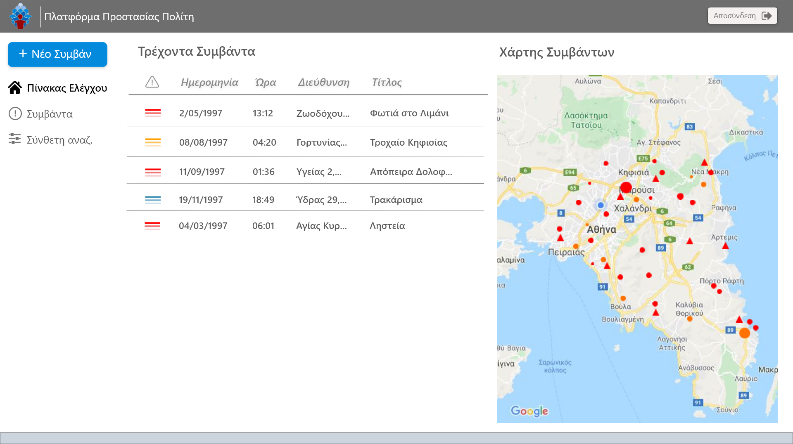
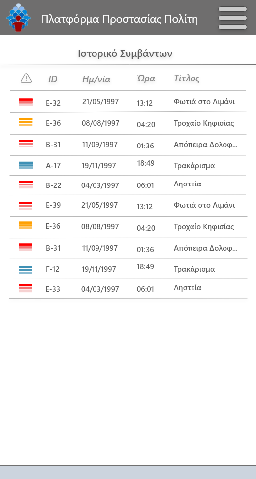

Wireframes
----------
Σελίδα Σύνδεσης

Μόλις κάποιος χρήστης ανοίξει την εφαρμογή η πρώτη σελίδα που εμφανίζεται είναι αυτή της σύνδεσης, η οποία είναι κοινή για όλες τις ομάδες χρηστών. 

>

### Κέντρο Ελέγχου

__1.1__ Αρχική σελίδα Κέντρου Ελέγχου έπειτα από σύνδεση.
>

__1.2__ Φόρμα νέου συμβάντος 
Αφού πατηθεί το κουμπί "Νέο Συμβάν" στην Αρχική σελίδα (1.1), εμφανίζεται η φόρμα του νέου συμβάντος(1.2).
>	

__1.3__ Αναζήτηση συμβάντος 
Πατώντας το κουμπί "Συμβάντα" στο αριστερό μενού της αρχικής σελίδας(1.1), εμφανίζεται η παρακάτω σελίδα που δίνει την δυνατότητα στο χρήστη να αναζητήσει συμβάντα σύμφωνα με κάποια φίλτρα.
>

__1.4__ Προβολή συμβάντος 
Επιλέγοντας κάποιο συμβάν είτε από την αρχική(1.1) είτε από την αναζήτηση συμβάντος(1.3), παρουσιάζονται οι λεπτομέρειες του περιστατικού.
>

### Τοπικά Τμημάτα Φορέων

__2.1__ Αρχική σελίδα τοπικών τμημάτων έπειτα από σύνδεση.
>

__2.2__ Ιστορικό συμβάντων για τα τοπικά τμήματα 
Επιλέγοντας το κουμπί "Συμβάντα" στο αριστερό μενού της αρχικής σελίδας(2.1), εμφανίζεται η παρακάτω σελίδα που εμφανίζει δίνει την δυνατότητα στο χρήστη να αναζητήσει προηγούμενα συμβάντα του τμήματος σύμφωνα με κάποια φίλτρα.
>

__2.3__ Προβολή συμβάντος για τα τοπικά τμήματα 
Επιλέγοντας κάποιο συμβάν είτε από την αρχική σελίδα(2.1) είτε από το ιστορικό(2.2), εμφανίζεται το συμβάν με τις λεπτομέρειες του.
>

### Προσωπικό Τοπικών Τμημάτων 

__3.1__ Αρχική προσωπικού τμημάτων έπειτα από σύνδεση.
>

__3.2__ Ιστορικό συμβάντος για το προσωπικό των τμημάτων 
Πατώντας το κουμπί "Συμβάντα" στο αριστερό μενού της αρχικής σελίδας(3.1), εμφανίζεται η παρακάτω σελίδα που δίνει την δυνατότητα στο χρήστη να αναζητήσει συμβάντα σύμφωνα με κάποια φίλτρα.
>

__3.3__ Προβολή συμβάντος για το προσωπικό των τμημάτων 
Επιλέγοντας κάποιο συμβάν από την αρχική σελίδα(3.1), από την αναζήτηση συμβάντος(3.2) ή από το αριστερό μενού πατώντας το κουμπί "Τρέχον Συμβάν", εμφανίζεται το συμβάν με τις λεπτομέρειες του.
>

### Αρμόδια Κυβερνητικά και Διοικητικά Στελέχη

__4.1__ Αρχική κυβερνητικών και διοικητικών στελεχών έπειτα από σύνδεση.
>

__4.2__ Εξαγωγή στατιστικών στοιχείων για τα Διοικητικά και Κυβερνητικά στελέχη 
Πατώντας το κουμπί "Σύνθετη Αναζήτηση" στο αριστερό μενού της αρχικής σελίδας(4.1), εμφανίζεται η παρακάτω σελίδα που δίνει την δυνατότητα στο χρήστη να εξάγει στατιστικά στοιχεία σχετικά με τα συμβάντα σύμφωνα με κάποια φίλτρα.
>

### Mobile App

__5.1__ Σελίδα σύνδεσης για την mobile εφαρμογή
>

__5.2__ Αρχική Σελίδα για τη mobile εφαρμογή έπειτα από σύνδεση 
Εμφανίζονται τα τρέχοντα συμβάντα του τμήματος που δεν έχει συμπληρωθεί το προσωπικό. Επιπλέον, φαίνεται πατημένο το μενού πάνω δεξιά.
>%20-%20mobile.png "5.2 Mobile: Αρχική Σελίδα")

__5.3__ Νέα ειδοποίηση για τη mobile εφαρμογή 
Κάνοντας επαναφόρτωση από το αντίστοιχο κουμπί στην αρχική σελίδα(5.2), αν υπάρχει κάποια ειδοποίηση, εμφανίζεται η παρακάτω σελίδα με μια προεπισκόπηση του νέου συμβάντος.
>

__5.4__ Ιστορικό συμβάντων για τη mobile εφαρμογή 
Επιλέγοντας το κουμπί του μενού πάνω δεξιά, εμφανίζεται το μενού(όπως φαίνεται στην 5.2). Πατώντας το κουμπί "Ιστορικό", εμφανίζονται τα προηγούμενα συμβάντα του χρήστη.
>

__5.5__ Προβολή συμβάντος για τη mobile εφαρμογή 
Επιλέγοντας κάποιο συμβάν από την αρχική σελίδα(5.2), από το ιστορικό(5.4) ή από την ειδοποίηση(5.3) πατώντας "Περισσότερες Λεπτομέρειες", ο χρήστης ανακατευθύνεται στην προβολή συμβάντος.
>
